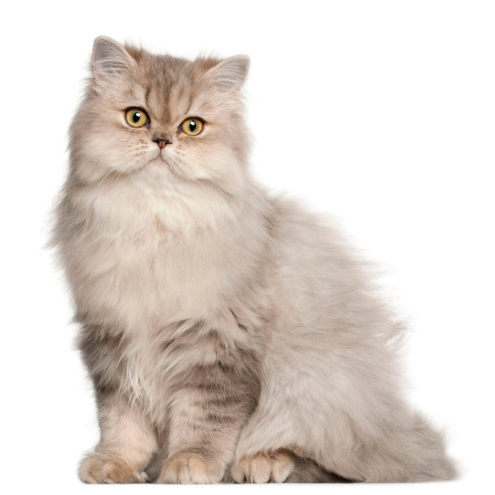

# My Cat Leo
I adopted my cat Leo when he was just 2 weeks old.He was my first pet and I had the best 6 months having him as my pet.Unfortunately i had to give him up for adoption since I moved from my country.But I'm so glad he got his forever home with his new friends.


## Background of Cats
Did you know that just 70 years ago, few cats lived entirely indoors at all? In fact, for more than **10,000 years, cats have lived outdoor lives, sharing the environment with birds and wildlife.** Understanding cats’ place in history and human evolution reveals how very recently domestic cats came indoors and how millions of this specieswho we call community catscontinue to live healthy lives outdoors today, *as all domestic cats are biologically adapted to do.*
~~Cats began their unique relationship with humans 10,000 to 12,000 years ago~~ in the **Fertile Crescent,** *Fertile Crescent* ~~Fertile Crescent~~ the geographic region where some of the earliest developments in human civilization occurred (encompassing modern day parts of West Asia). One such development was agriculture. As people abandoned their nomadic lifestyle and settled permanently to farm the land, stored grain attracted rodents.

Taking advantage of this new, abundant food source, Middle Eastern wildcats, or felix silvestris lybica, preyed on the rodents and decided to stick around these early towns, scavenging the garbage that all human societies inevitably producejust as community cats do today.

Over thousands of years, a new species of cat eventually evolved that naturally made its home around people: felis catus. Pet, stray, and feral cats (stray and feral cats are community cats) are all this same species, which we call the domestic cat

### Types of Cats
1. Pets
   1. Dog
   2. Cat
2. Food
   1. Hamburger
   2. Pizza 
3. Jobs
   1. Programmer
   2. Engineer  

I **love** Linux
Markdown is a **lightweight markup language** for creating formatted text using a **plain text editor**
**Groceries**
1. Bread
2. Milk
   1. Almond Milk
   2. Cashew Milk
   3. Regular Milk
3. Eggs
4. Cofee
5. Vegetables

  **Types of Computers**
   * personal computer or PC 
   * smartphone
        * apple or iphone
        * samsung
        * google phone
  * microcontroller
  > The 1958 article published in the Harvard Business Review refers to information technology that consists of three basic parts: computational data processing, decision support, and business software. Information technology refers to anything related to computing technology, such as networking, hardware, software, the Internet, or people working with these technologies.

  > Many companies now have IT departments to manage computers, networks, and other technical areas of their businesses. IT jobs include computer programming, network administration, computer engineering, web development, technical support, and many other related occupations.
  **Writing hello world in phyton**
  ```
  #!/usr/bin/phyton3
  print('Hello World')
  ```
  Ubuntu update command 
  `sudo apt update; sudo apt upgrade -y`
  Click [here](https://www.intagram.com/) to go to Instagram.
  Click [here](https://www.youtube.com/) to go to Youtube
  Click [here](https://www.facebook.com/) to go to facebook
  Click 
  Click 
   Friends List

   |name|phone|ig tag|
   |----|-----|-------|
   |bob|112234789|bob678|
