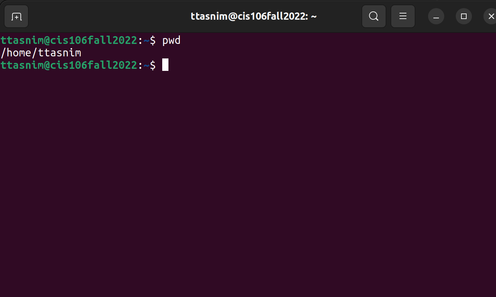

# Week Report 4

## Practice

## The Filesystem (Some Important Directories)

| Directory | Data Stored in Directory                                                 |
| --------- | ------------------------------------------------------------------------ |
| bin       | Essential commands                                                       |
| dev       | Device files                                                             |
| etc       | System configuration files                                               |
| home      | User home directories                                                    |
| media     | Mount point for removable media such as DVDs and floppy disks            |
| opt       | Add on software packages                                                 |
| proc      | Kernel information, process control, system hardware information         |
| srv       | Information relating to services that run on the system                  |
| usr       | Software not essential for system operation, such as applications        |
| var       | Dedicated to variable data, files that persist from one boot to the next |

## Commands to navigate the filesystem

| Command | What it does                                    | Syntax | Example |
| ------- | ----------------------------------------------- | ------ | ------- |
| pwd     | prints current working directory                | `pwd`  | `pwd`   |
| cd      | Changes the current directory                   | `cd`   | `cd`    |
| ls      | Displays all the files inside a given directory | `ls`   | `ls`    |

## Key terms

*Definitions of the following terms*

* **File system :** The way files are stored and organised to simplify access to data.
* **Current directory :** The directory where you are at the moment.
* **parent directory :** You are always working inside a particular directory and you can move forward to a subdirectory or backwards to the previous directory- called a parent directory.
* **the difference between your home directory and the home directory :** When you open your terminal emulator, your current working directory is your home directory. The home directory is the root directory, the root user is the administrator of your system. In the Linux system everuthing comes under the root directory and on the other hand, the home directory contains a particular user's data.
* **pathname :** Indicates the location of the file in the filesystem (like an address).
* **relative path :** The location of a file starting from the current working directory or a directory that is located inside the current working directory.
* **absolute path :** The location of a file starting a the root of the file system.
* **The commands are used for navigating the filesystem :**
    * pwd
    * cd
    * ls
