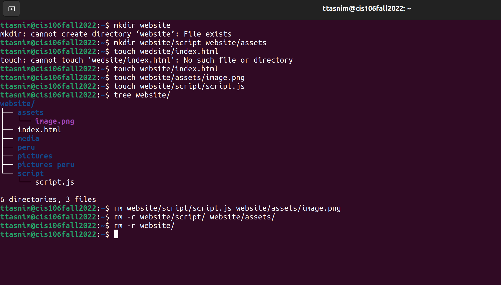
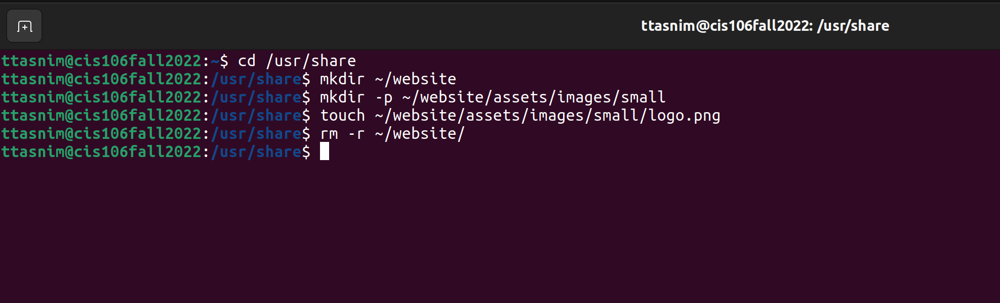
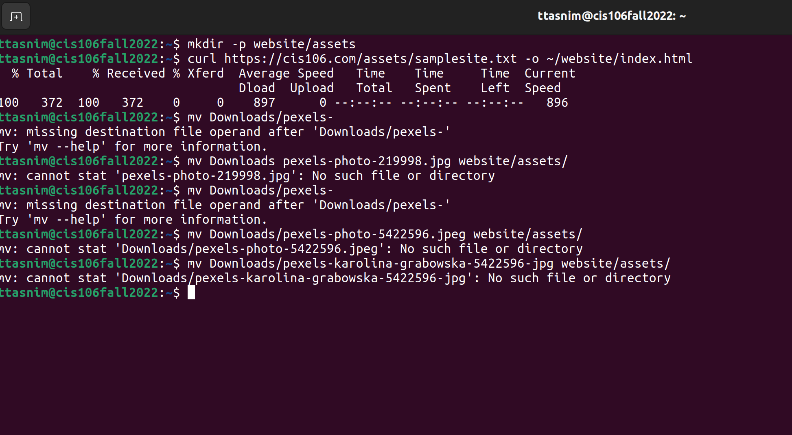

# Week Report 5

## What are Command Options?
Answer: Command options are which commands are often followed by that modify?enhance their behavior.
## What are Command Arguments?
Answer: Command arguments are what commands are followed by which are the items open which the command acts on.
## Which command is used for creating directories? Provide at least 3 examples.
Answer: 1. Create a directory in the present working directory: `mkdir wallpapers`
        2. Create a directory in a different directory using relative path: `mkdir wallpapers/ocean`
        3. Create a directory in a different directory using absolute path: `mkdir ~/wallpapers/forest` 
## What does the touch command do? Provide at least 3 examples.
Answer: 1. To create a file called list: `touch list`
        2. To create several files: `touch list_of_cars.txt script.py names.csv`
        3. To create a file using absolute path: `touch ~/Downloads/games.txt`
## How do you remove a file? Provide an example.
Answer: rm removes files. An example is; Remove a file and prompt confirmation before removal :`rm -i list`
## How do you remove a directory and can you remove non-empty directories in Linux? Provide an example
Answer: To remove a directory: `rmdir Downloads/games`
Yes, you can remove a non-empty directory in Linux. To remove a non-empty directory: `rm -r Downloads/games`
## Explain the mv and cp command. Provide at least 2 examples of each
Answer : The mv command is the command which moves and renames directories.
Examples: 1. To move a file from a directory to another using relative path: `mv Downloads/homework.pdf Documents/`
          2. To move a directory from one directory to another using absolute path: `sudo mv ~/Downloads/theme /usr/share/themes`

The cp command is the command which copies files/directories from a source to a destination.
Examples: 1.To copy a file: `cp Downloads/wallpapers.zip Pictures/`
          2. To copy a directory with absolute path: `cp -r ~/Downloads/wallpapers ~/pictures/`

## Practice 
* Practice 1
  
* Practice 2
  
* Practice 3
  
* practice 4
  
 