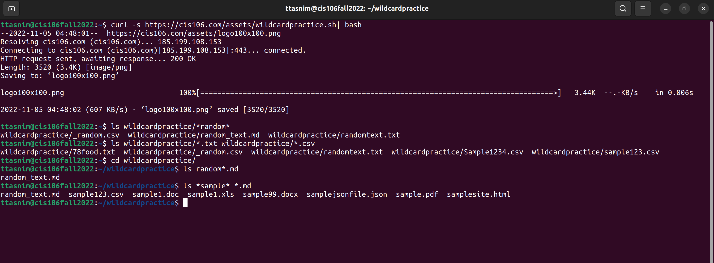
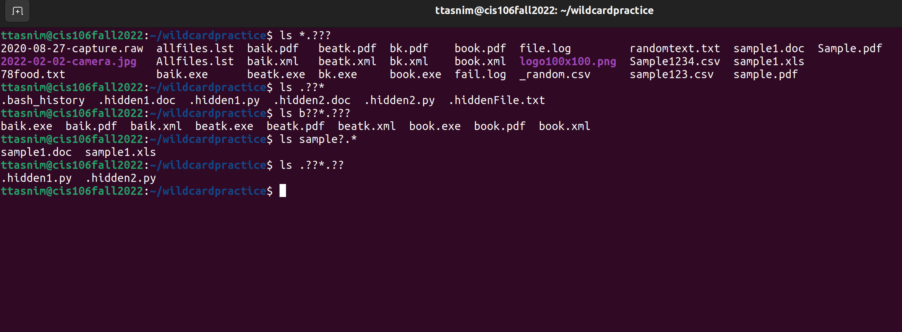
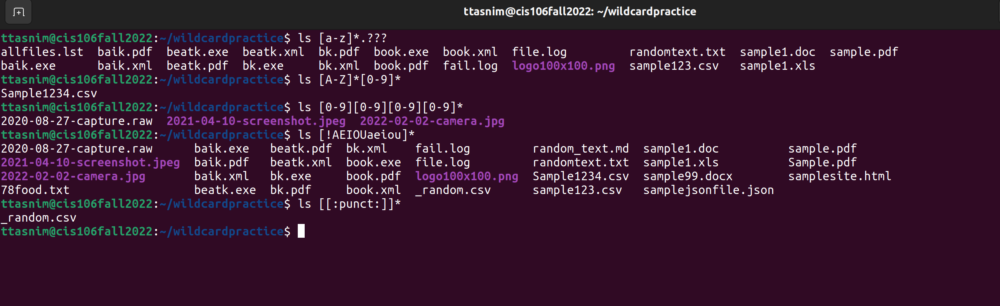

# Week Report 6
 
## Wildcards

### * Wildcard
The * wildcard matches from 0 to any number of characters.
* Examples:
    * List all the text file ina directory
      * `ls *.txt`
    * List all the files that start with the word file
      * `ls file*`
    * Copy all the mp4 files
      * `cp Downloads/*.mp4 ~/Videos/Movies/`
### ? Wildcard
The ? wildcard matches a single character.
* Examples:
   * List all the hidden files in the current directory
      * `ls ./.??*`
    * List all the hidden files in the parent directory
      * `ls ../.??*`
    * List all the files that have a 3 letter file extension
      * `ls *.???`   
### [] wildcard
The [] wildcard matches a single character in a range.
* Examples:
    * To match all files that have a vowel after letter f:
       * `ls f[aeiou]*`
     * To match all files that have a range of letters after f:
       * `ls f[a-z]*`
     * To match all files whose name has at least one number:
       * `ls *[0-9]*`
### Brace Expansion
Brace expansion {} is not a wildcard but another feature of bash that allows you to generate arbitrary strings to use with commands.
* Examples:
    * To create a whole directory structure in a single command:
       * `mkdir -p music/{jazz,rock}/{mp3files,videos,oggfiles}/new{1..3}`
    * To create a N number of files use:
       * `touch website{1..5}.html`
       * `touch file{A..Z}.txt`
       * `touch file{001..10}.py`
       * `touch file{{a..z},{0..10}}.js`
    * To remove multiple files in a single directory:
       * `rm -r {dir1,dir2,dir3,file.txt,file.py}`  

## Practice
   # Practce 5

   # Practice 6

   # Practice 7
